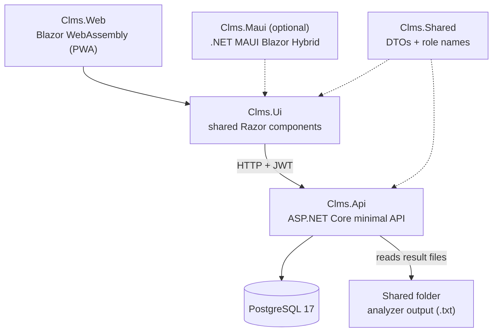

# CLMS Tech Stack

Summary of the technologies under investigation for building the Clinical Laboratory
Management System (SFWE 403/503, Fall 2026).

## At a glance

- **One language end to end:** C# on .NET 10, for the server, the UI and the tests.
- **One API** owns all business rules and data; every client goes through it.
- **Web app first:** one UI codebase that runs in the browser. Native iOS, macOS,
  Windows and Android apps are optional and can reuse the same screens later.
- **PostgreSQL** in Docker for data; no cloud services required to develop.

## Proposed system structure

| Project | Role |
|---|---|
| `Clms.Api` | Backend: endpoints, auth, business rules, database, instrument file ingestion |
| `Clms.Ui` | All screens and client services, shared by the web app and any native app |
| `Clms.Web` | Browser host (installable PWA) |
| `Clms.Maui` | *Optional:* native host for iOS, macOS, Windows and Android |
| `Clms.Shared` | Request/response types and role names used by both client and server |
| `Clms.Tests` | Automated tests |

## Tech stack by layer

### Frontend

| Technology | Used for | Why |
|---|---|---|
| **Blazor WebAssembly** | Browser app | Write the UI in C# and share types with the API |
| **Progressive Web App** (service worker + manifest) | Installable web app that opens offline | Caches the app shell only; lab data always comes live from the API |
| **Razor Class Library** | Shared UI (`Clms.Ui`) | Screens are written once, so a native app can reuse them later |
| **.NET MAUI Blazor Hybrid** *(optional)* | Native apps: iOS 15+, macOS (Mac Catalyst) 15+, Windows 10 1809+, Android 7.0+ | Reuses the same Blazor components inside a native window. **Linux is not supported by MAUI**; Linux users run the web app in a browser or install it as a PWA |

### Backend

| Technology | Used for | Why |
|---|---|---|
| **ASP.NET Core minimal APIs** (.NET 10) | REST endpoints grouped by feature | Lightweight, little boilerplate |
| **JWT bearer authentication** | Sign-in token issued once Identity accepts the credentials; carries the user's role | No server-side session to manage, and the same token works for the web app and any native app |
| **Role-based authorization policies** | Restrict actions per ConOps user type | Enforced on the server for every request |
| **ASP.NET Core Identity** | User accounts, password hashing and rules, password set at first login and changed later, lockout after failed attempts and manager unlock | Covers the log-in requirements (ConOps 6.2.1–6.2.7) instead of writing them by hand |
| **Hosted background service** | Watches the shared folder for analyzer result files | Runs inside the API; checking the folder on a timer is reliable across Docker mounts and network shares |
| **OpenAPI + Scalar** | Interactive API documentation | Explore and test endpoints in the browser; Swagger UI is the alternative docs page |

### Data

| Technology | Used for | Why |
|---|---|---|
| **PostgreSQL 17** | Relational database | Free, reliable, runs anywhere in Docker |
| **Entity Framework Core 10 + Npgsql** | Object–relational mapping | Query and save C# entities without hand-written SQL |

### Testing

| Technology | Used for |
|---|---|
| **xUnit** | Unit tests for parsing, business rules and validation |

### Development and tooling

| Technology | Used for |
|---|---|
| **.NET 10 SDK** | Build, run and test on macOS and Windows |
| **Docker Desktop + Docker Compose** | PostgreSQL locally; optionally the API as a container |
| **VS Code + C# Dev Kit**, or **Visual Studio 2026** (Windows) | IDE and debugging |
| **Xcode** (macOS only) | Only if building the optional iOS or Mac apps |
| **Android SDK + Java JDK** (via Android Studio) | Only if the team explores an Android app |
| **Git + GitHub** | Version control, with the source code in a shared GitHub repository for the team |

## Alternatives, if cross-platform reach matters

The web app already runs on every desktop and mobile OS with a browser, Linux included, so
these only come into play if we want installable or store-distributed apps.

| Option | Covers | Trade-offs |
|---|---|---|
| **Web app / PWA** *(proposed)* | Everything with a browser: Windows, macOS, **Linux**, iOS, Android | Installs to the desktop or home screen, no app store needed. Limited access to device hardware |
| **.NET MAUI Blazor Hybrid** *(proposed, optional)* | iOS, Android, Windows, macOS | Reuses the Blazor screens; all C#. No Linux |
| **Capacitor** | iOS, Android, web (official); desktop only through a community Electron project | Wraps a web build in a native shell. JavaScript and Node toolchain, and its plugins are reached from C# indirectly |
| **Electron** | Windows, macOS, **Linux** desktop | The usual way to get a native Linux desktop app; large download and memory footprint |
| **Photino** | Windows, macOS, **Linux** desktop | Much lighter than Electron and can host Blazor directly; smaller community, and its maintainers announced a change of direction in March 2026 |

Worth watching: an Avalonia-powered backend would add Linux and browser targets to MAUI, but
its first preview (March 2026) needs a preview build of .NET 11.

## Still to decide

| Need | Options under consideration |
|---|---|
| Lockout notification email (ConOps 6.2.6) | Brevo, SendGrid or plain SMTP, behind a notification service |
| Database schema changes | **EF Core migrations:** versioned change scripts; the standard choice once a database holds data we care about  **Hand-written SQL scripts:** full control, but more to write and keep in order  **Recreate the database on each change:** simplest while developing, but wipes the data every time |
| Secrets (JWT signing key, DB password) | **.NET user-secrets on each machine, environment variables where it's deployed:** no extra service, nothing secret in the repository  **Managed store (Azure Key Vault, AWS Secrets Manager):** central and audited, but ties us to a cloud provider and may cost  **Environment file on the host:** easy for self-hosting; must be kept out of version control and backed up |
| Native apps (iOS, macOS, Windows, Android) | Optional, if time allows or the team wants to explore it. The web app comes first; MAUI can be added later without rewriting screens. Android builds on both Mac and Windows and installs on phones or lab handhelds without a developer account |
| Hosting and deployment | **[Azure for Students](https://azure.microsoft.com/en-us/free/students):** $100 credit, no credit card; free Static Web Apps tier for the web app, API and PostgreSQL paid from the credit  **AWS ([AWS Educate](https://aws.amazon.com/education/awseducate/) for students, [Free Tier](https://aws.amazon.com/free/)):** up to $200 in Free Tier credits, but the free plan ends after 6 months or when credits run out  **UGREEN NAS (self-hosted):** Docker Compose behind a Cloudflare Tunnel; free, always on, access limited to the team with Cloudflare Access (free up to 50 users) |
| Automated tests for screens and API endpoints (beyond unit tests) | Not chosen yet; candidates include bUnit for Blazor components and ASP.NET Core integration tests for the API |
